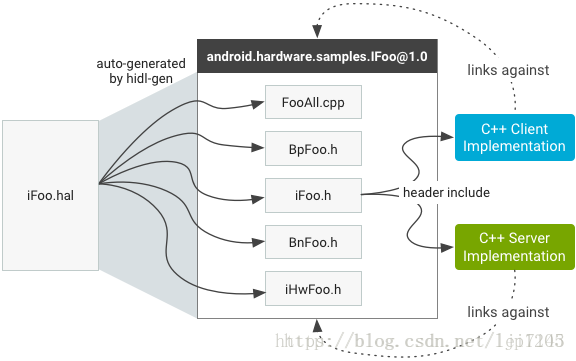

# HIDL PassThrough

## Create HAL interface
mkdir -p hardware/interfaces/mgpio/1.0/default 
touch hardware/interfaces/mgpio/1.0/IMgpio.hal
touch hardware/interfaces/mgpio/1.0/types.hal

## Build hidl-gen
make hidl-gen -j10

## Generate HAL files
PACKAGE=android.hardware.mgpio@1.0
LOC=hardware/interfaces/mgpio/1.0/default/
HIDL_GEN=out/host/linux-x86/bin/hidl-gen
$HIDL_GEN -o $LOC -Lc++-impl -randroid.hardware:hardware/interfaces -randroid.hidl:system/libhidl/transport $PACKAGE
$HIDL_GEN -o $LOC -Landroidbp-impl -randroid.hardware:hardware/interfaces -randroid.hidl:system/libhidl/transport $PACKAGE

- Tạo các tệp triển khai C++ cho gói HIDL được chỉ định ($PACKAGE). Các tệp đầu ra sẽ được đặt trong thư mục được chỉ định bởi $LOC
- Tạo các tệp Android.bp build cho gói HIDL được chỉ định ($PACKAGE). Các tệp build này cần thiết để tích hợp mã đã tạo vào hệ thống build của Android. Các tệp đầu ra cũng sẽ được đặt trong thư mục được chỉ định bởi $LOC.

- $HIDL_GEN: Đại diện cho tệp thực thi của HIDL generator.
- $LOC: Vị trí thư mục đầu ra cho các tệp được tạo.
- $PACKAGE: Tên gói HIDL.
- Lc++-impl: Tạo các tệp triển khai C++.
- Landroidbp-impl: Tạo các tệp Android.bp build.
- randroid.hardware:hardware/interfaces: Chỉ định thư mục gốc cho gói android.hardware.
- randroid.hidl:system/libhidl/transport: Chỉ định thư mục gốc cho gói android.hidl.

Android.bp
    passthrough
        cc_library_shared
            name: "android.hardware.mgpio@1.0-impl"

    binderized
        cc_binary
            name: "android.hardware.mgpio@1.0-service"

        - Thay đổi -impl thành -service: Trong tên của module, thay đổi hậu tố từ -impl thành -service để chỉ định rằng đây là một dịch vụ binderized.
        Chuyển từ cc_library_shared sang cc_binary: Thay đổi cấu hình từ một thư viện chia sẻ thành một nhị phân chạy như một dịch vụ.
        - *Thêm tệp .rc: Thêm một tệp *.rc cho module để cấu hình dịch vụ này trong hệ thống init của Android.
        - Xóa các hàm HIDL_FETCH_I:* Các hàm này thường được sử dụng trong passthrough HAL và không cần thiết cho binderized HAL.
        - Gọi configureRpcThreadpool và registerAsService: Thiết lập luồng RPC và đăng ký dịch vụ HAL.

Passthrough HAL: Được triển khai như một sharedlib (cc_library_shared). Trong mô hình này, các cuộc gọi HAL được thực hiện trực tiếp thông qua không gian người dùng mà không cần thông qua hệ thống Binder IPC.

Binderized HAL: Được triển khai như một service (cc_binary). Các cuộc gọi HAL sẽ thông qua hệ thống Binder IPC, điều này làm tăng tính bảo mật và quản lý tốt hơn.

## Implement the shared library HAL Server

## Update Makefiles
./hardware/interfaces/update-makefiles.sh

## Build
mmm hardware/interfaces/mgpio/

## Output
Interface Library
    android.hardware.mgpio@1.0.so
        Đây là file thư viện interface (giao diện) HIDL. Nó chứa định nghĩa của các interface HIDL được sử dụng bởi hệ thống và các ứng dụng để giao tiếp với tầng HAL (Hardware Abstraction Layer).

Implementation Library
    android.hardware.mgpio@1.0-impl.so
        Đây là file thư viện triển khai (implementation). Nó chứa mã thực thi của các phương thức được định nghĩa trong interface HIDL.
        Đây là nơi mà các phương thức được định nghĩa trong IMgpio.hal thực sự được triển khai, tức là viết mã cụ thể để điều khiển phần cứng hoặc thực hiện các chức năng cần thiết.

### Operation
Khi một ứng dụng hoặc thành phần hệ thống muốn sử dụng chức năng GPIO, nó sẽ gọi các phương thức được định nghĩa trong file interface HIDL (ví dụ: IMgpio.hal).

Ví dụ, một ứng dụng muốn xuất một GPIO sẽ gọi phương thức exportGpio(int32_t pin) từ interface.

Lời gọi phương thức từ interface sẽ được chuyển tiếp đến thư viện triển khai. Hệ thống HIDL sẽ tìm và gọi thực thi tương ứng từ thư viện triển khai (android.hardware.mgpio@1.0-impl.so).
Trong thư viện triển khai, phương thức exportGpio(int32_t pin) sẽ thực hiện công việc thực tế, như mở tệp /sys/class/gpio/export và ghi giá trị của pin vào đó.

## Register HAL Server

touch hardware/interfaces/mgpio/1.0/default/android.hardware.mgpio@1.0-service.rc
touch hardware/interfaces/mgpio/1.0/default/service.cpp

## Client test program
mkdir -p hardware/interfaces/mgpio/1.0/tests
touch hardware/interfaces/mgpio/1.0/tests/Android.bp
touch hardware/interfaces/mgpio/1.0/tests/mgpio_test.cpp

## Role
- android.hardware.mgpio@1.0-service.rc: Start android.hardware.mgpio@1.0-service
- android.hardware.mgpio@1.0-service: Register and start server
- android.hardware.mgpio@1.0.so: HAL framwork interface, exposed to the client 
- android.hardware.mgpio@1.0-impl.so: The code mplementation of mgio module
- mgpio_test: Client

## Run on Board
adb push android.hardware.mgpio@1.0.so /system/lib64
adb push android.hardware.mgpio@1.0-impl.so /vendor/lib64/hw
adb push android.hardware.mgpio@1.0-service /system/bin/
adb push mgpio_test /vendor/bin/hw

adb push out/target/product/vf_generic/system/lib64/android.hardware.mgpio@1.0.so /system/lib64
adb push out/target/product/vf_generic/vendor/lib64/hw/android.hardware.mgpio@1.0-impl.so /vendor/lib64/hw
adb push out/target/product/vf_generic/vendor/bin/hw/android.hardware.mgpio@1.0-service /system/bin/
adb push out/target/product/vf_generic/system/bin/mgpio_test /system/bin/

### Important
- Remember to add the definition of the vendor interface in the manifest file, otherwise the service will not be available on the client side. Add the following to the corresponding manifest.xml

/device/<your-vendor>/<your-device>/manifest.xml
<hal format="hidl">
    <name>android.hardware.mgpio</name>
    <transport>hwbinder</transport>
    <version>1.0</version>
    <interface>
        <name>IMgpio</name>
        <instance>default</instance>
    </interface>
</hal>

# Fundametals

## Passthrough HAL
This is a packaging of the original HAL, but the final binder service and binder client live in the same process. This should be compatible with the old version of HAL.

Passthrough mode is only available for C   clients and implementations. Devices running earlier versions of Android do not have HALs written in Java, so Java HALs must use binderized mode.

Since passthrough HALs run in the same process that calls them, in most cases passthrough methods are called directly through the function (same thread). Oneway methods run in their own thread, because they are not intended to wait for the HAL to process them (this means that any HAL that uses oneway methods in passthrough mode must be thread-safe).

## Binderized HAL
HAL is written as binder service (server), Android FW is binder client  

Packages provided by Google are called core package, and package names always android.hardware. For example, the name of the NFC package should be android.hardware.nfc. These core packages are stored in hardware/interface

Packages provided by chip manufacturers and ODM manufacturers are called non-core package, and package names generally vendor.$(vendorName).hardware.start with , such as vendor.vf.hardware.. These non-core packages are generally stored in vendor

## HIDL Binderzed